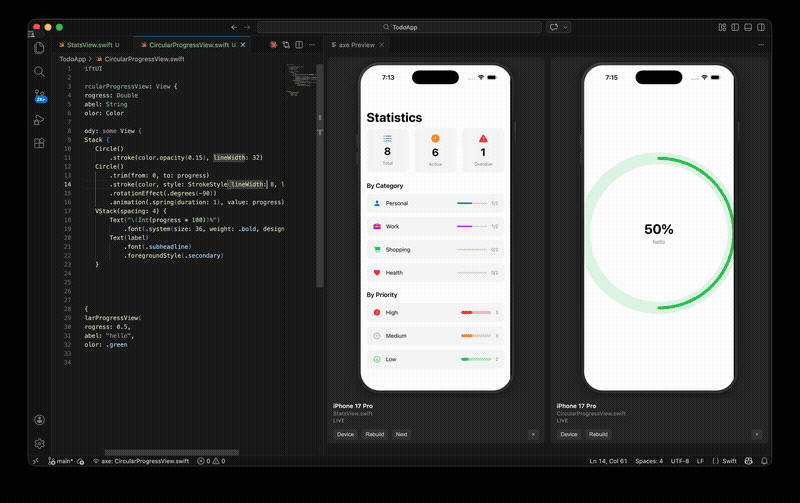
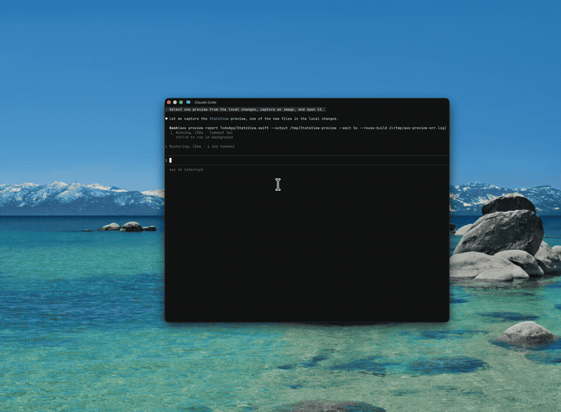
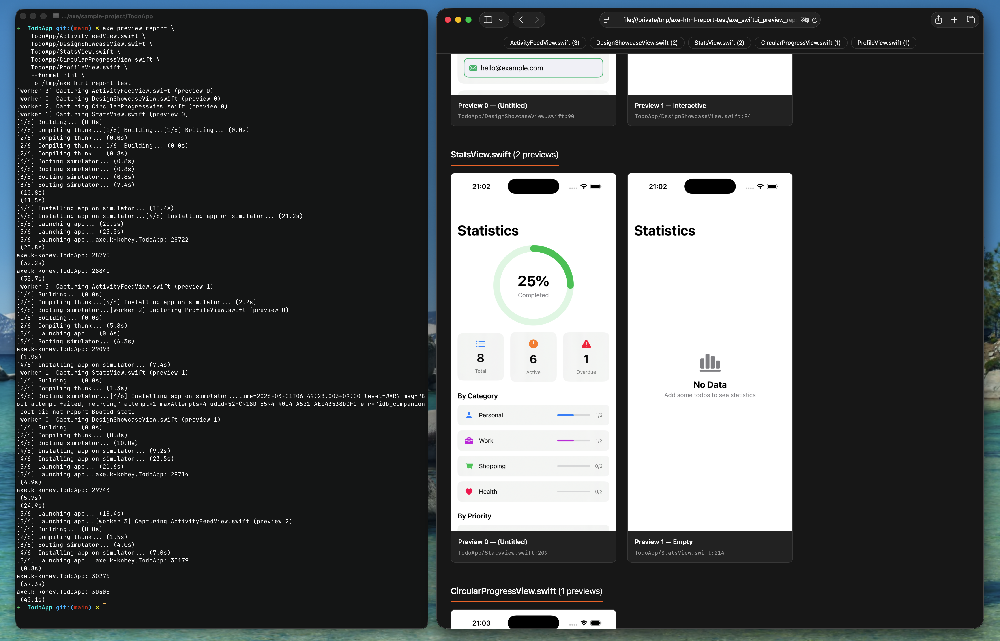
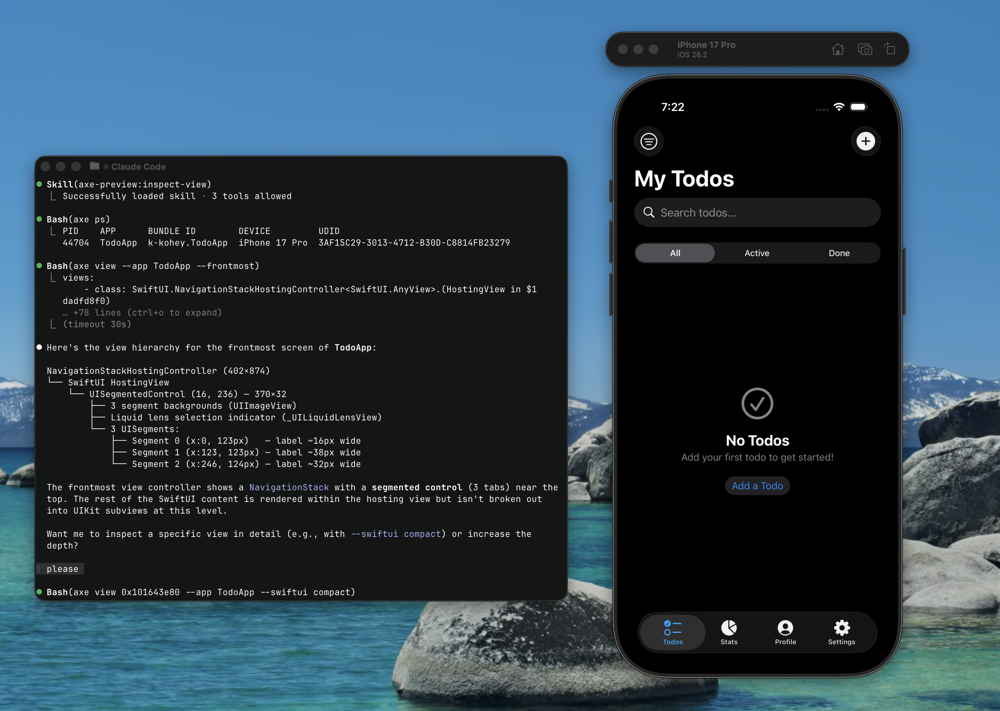

<p align="center">
  
</p>

<h1 align="center">axe</h1>

<p align="center">SwiftUI live preview with hot-reload, and view hierarchy inspection, all from the command line.</p>

## Features

### 🖥️ VS Code / Cursor Extension

Open a Swift file with `#Preview` and the preview starts automatically. See [vscode-extension/README.md](vscode-extension/README.md).

axe is a CLI tool for running SwiftUI Previews with hot-reload support.
It works standalone, but also supports Protobuf-defined input/output schemas so you can pair it with any frontend.
As a reference implementation, a VS Code / Cursor extension is available:
https://marketplace.visualstudio.com/items?itemName=k-kohey.axe-extension
Multi-simulator management, preview frame streaming, and input forwarding are all handled by axe as the backend.

To build your own client (Emacs, Vim, web frontend, etc.), try the serve command:

```bash
axe preview serve [flags]
```



### 🤖 AI Agent Coding Support

CLI-first design enables AI agents to operate SwiftUI Previews directly.

Since every operation is available through the CLI, AI agents such as Claude Code can use axe without a GUI. The simulator runs headlessly.
A Claude Code plugin is provided with skills for capturing previews, reviewing UI, and inspecting view hierarchies — all driven autonomously by the agent. Files with multiple `#Preview` blocks are fully supported.

Install the Claude Code plugin:
```bash
# Register the marketplace
claude plugin marketplace add k-kohey/axe

# Install the plugin
claude plugin install axe-preview@axe
```

All features are accessible via the CLI, making it straightforward to capture previews from multiple processes or integrate with CI.



### 📸 Report

Batch-capture screenshots of every `#Preview` block and generate a Storybook-style report.

`axe preview report` captures screenshots of all `#Preview` blocks in the specified Swift files and outputs them as PNG, Markdown, or HTML. Useful for visual review in PRs or automated UI catalog generation. Host the generated HTML to use it as a living storybook.



### 🔍 View Hierarchy Inspection

Dump the UIKit/SwiftUI view hierarchy via LLDB, with an interactive TUI browser and per-view PNG snapshots.

Processing images is generally slower than processing text. The `axe view` command provides a text-based alternative for quickly inspecting views or helping AI agents understand view structure.




## Requirements

- macOS (Apple Silicon)
- Xcode (command-line tools)
- [`idb_companion`](https://github.com/facebook/idb) — for headless simulator management

## Install

```bash
curl -fsSL https://raw.githubusercontent.com/k-kohey/axe/main/install.sh | sh
```

The installer also installs `idb_companion` via Homebrew if not present. To install it manually:

```bash
brew install facebook/fb/idb-companion
```

Or download a binary from the [Releases](https://github.com/k-kohey/axe/releases) page.

## Quick Start

Create a `.axerc` in your project root so you don't have to pass flags every time:

```
PROJECT=MyApp.xcodeproj
SCHEME=MyApp
```

Then preview any Swift file containing `#Preview`:

```bash
# Oneshot: capture screenshot to stdout
axe preview MyView.swift > screenshot.png

# Watch mode: hot-reload on file changes
axe preview watch MyView.swift
```

## Usage

### `axe preview`

Launch a SwiftUI preview on a headless iOS Simulator.

The `preview` command has several subcommands:

| Command | Description |
|---|---|
| `axe preview <file>` | Oneshot: capture a PNG screenshot to stdout, then exit |
| `axe preview watch <file>` | Watch for file changes and hot-reload |
| `axe preview serve` | Run as multi-stream IDE backend (JSON Lines protocol) |
| `axe preview report` | Capture screenshots of all `#Preview` blocks |
| `axe preview simulator` | Manage simulators for preview |

#### Oneshot Mode (default)

```bash
axe preview MyView.swift > screenshot.png
axe preview <source-file.swift> [flags]
```

Builds and launches the preview, captures a **PNG screenshot to stdout**, then exits (exit 0 on success, exit 1 on failure).

| Flag | Description |
|---|---|
| `--preview` | Select a `#Preview` block by title or index (e.g. `--preview "Dark Mode"` or `--preview 1`) |
| `--reuse-build` | Skip xcodebuild and reuse previous build artifacts |
| `--full-thunk` | Use full thunk compilation (per-file dynamic replacement) |

#### `axe preview watch`

```bash
axe preview watch MyView.swift
axe preview watch <source-file.swift> [flags]
```

Watch the source file for changes and hot-reload the preview. Body-only changes are hot-reloaded without rebuilding; structural changes trigger a full rebuild automatically.

| Flag | Description |
|---|---|
| `--preview` | Select a `#Preview` block by title or index |
| `--reuse-build` | Skip xcodebuild and reuse previous build artifacts |
| `--strict` | Require full thunk compilation (no degraded fallback) |
| `--headless` | Run simulator headlessly without a display window |

#### `axe preview serve`

```bash
axe preview serve [flags]
```

Run as a multi-stream IDE backend. Streams are managed via JSON Lines commands on stdin (`AddStream`/`RemoveStream`), and events (`Frame`/`StreamStarted`/`StreamStopped`/`StreamStatus`) are emitted on stdout. Used by the VS Code / Cursor extension.

| Flag | Description |
|---|---|
| `--strict` | Require full thunk compilation (no degraded fallback) |

#### Common Flags

These flags are shared by all `preview` subcommands:

| Flag | Description |
|---|---|
| `--project` | Path to `.xcodeproj` |
| `--workspace` | Path to `.xcworkspace` (mutually exclusive with `--project`) |
| `--scheme` | Xcode scheme to build (required) |
| `--device` | Simulator UDID to use (searches axe set first, then standard Xcode set) |
| `--configuration` | Build configuration (e.g. `Debug`) |

All flags fall back to `.axerc` values when not specified.

#### `axe preview report`

Capture all `#Preview` blocks in one or more Swift files as screenshots (`png`), a Markdown report (`md`), or an HTML report (`html`).

```bash
# Single file → single file
axe preview report Sources/FooView.swift -o screenshot.png

# Multiple files → directory (auto-created)
axe preview report Sources/FooView.swift Sources/BarView.swift -o ./screenshots/

# Markdown report + external PNG assets (directory required)
axe preview report Sources/FooView.swift Sources/BarView.swift --format md -o ./preview-report

# HTML report (responsive, dark-mode, lightbox) + external PNG assets
axe preview report Sources/FooView.swift Sources/BarView.swift --format html -o ./preview-report
```

When `--output` is a directory, screenshots are saved as `<basename>--preview-<index>.png`.
For `--format md` or `--format html`, `--output` must be a directory, and axe writes:
- `axe_swiftui_preview_report.md` (or `.html`)
- `axe_swiftui_preview_report_assets/*.png`
The project build is reused automatically after the first capture.

| Flag | Description |
|---|---|
| `-o`, `--output` | Output path. Required. For `--format png`: directory or file. For `--format md`/`html`: directory only |
| `--format` | Output format: `png` (default), `md`, or `html` |
| `--wait` | Rendering delay before capture (default `10s`) |

Project flags (`--project`, `--scheme`, etc.) are shared with the parent `preview` command.

#### Simulator Management

axe manages its own isolated simulator device set, separate from your normal simulators. When `--device` specifies a UDID from the standard Xcode simulator set, axe uses it directly and does **not** shut it down on exit.

```bash
# List managed simulators
axe preview simulator list

# List available device types and runtimes
axe preview simulator list --available

# Add a simulator
axe preview simulator add \
  --device-type com.apple.CoreSimulator.SimDeviceType.iPhone-16-Pro \
  --runtime com.apple.CoreSimulator.SimRuntime.iOS-18-2

# Set the default simulator
axe preview simulator default <udid>

# Remove a simulator
axe preview simulator remove <udid>
```

### `axe view`

Inspect the UIKit view hierarchy of a running app on a simulator.

```bash
axe view [0xADDRESS] [flags]
```

**Tree mode** (default):

```bash
# Full view hierarchy
axe view

# Frontmost view controller only
axe view --frontmost

# Limit depth
axe view --depth 3
```

**Detail mode** (with address):

```bash
# Detailed info + PNG snapshot for a specific view
axe view 0x10150e5a0

# Include SwiftUI tree
axe view 0x10150e5a0 --swiftui compact
```

**Interactive mode**:

```bash
axe view -i
```

| Flag | Description |
|---|---|
| `--depth` | Maximum tree depth to display |
| `--frontmost` | Show only the frontmost view controller's subtree |
| `--swiftui` | SwiftUI tree mode: `none`, `compact`, `full` (detail mode only) |
| `-i`, `--interactive` | Interactive TUI navigation |
| `--simulator` | Target simulator by UDID or name |

### Global Flags

| Flag | Description |
|---|---|
| `--app` | Target app process name (overrides `.axerc`) |
| `-v`, `--verbose` | Verbose output |

## VS Code Extension

A VS Code / Cursor extension that runs `axe preview` automatically when you open a Swift file containing `#Preview`.

Download the `.vsix` from the [Releases](https://github.com/k-kohey/axe/releases) page:

- **VS Code**: `code --install-extension axe-swiftui-preview-<version>.vsix`
- **Cursor**: `Cmd+Shift+P` > "Install from VSIX..."

See [vscode-extension/README.md](vscode-extension/README.md) for configuration and development details.

## Configuration (`.axerc`)

Place a `.axerc` file in your project root. Flags specified on the command line take precedence.

```
PROJECT=MyApp.xcodeproj
SCHEME=MyApp
CONFIGURATION=Debug
DEVICE=<simulator-udid>
```

## Known Issues

### Hot Reload (`preview watch`)

- **Stored properties cannot be hot-reloaded**: `let`, `@State`, `@Published` etc. change memory layout and automatically trigger a full rebuild. Computed properties and methods are hot-reloaded.
- **Generic/static/class methods and initializers are not hot-reloaded**.
- **Without the Index Store, only direct (1-level) dependencies are watched**: Transitive dependency detection relies on the Index Store that `xcodebuild` generates. If the Index Store is unavailable (e.g. before the first build or after deleting DerivedData), axe falls back to 1-level resolution — changes to indirect dependencies will not trigger hot-reload until the next build regenerates the Index Store.

### Source Parsing

- **Indirect protocol conformance is not detected**: `struct Foo: MyProtocol` where `MyProtocol: View` is not recognized. Direct `: View` and `extension`-based conformance are supported.

### Preview Macro

- **`#Preview(traits:)` display traits are ignored**: The preview block itself works, but trait parameters such as `.landscapeLeft` have no effect.

### Platform

- **Apple Silicon only**: The preview compiler targets `arm64` exclusively.

## Contributing

Contributions are welcome! Bug reports, feature requests, and pull requests are all appreciated.

```bash
mise install   # Set up dependencies
mise run test  # Run tests
mise run check # Lint
```

Running `mise install` sets up the full development environment.
